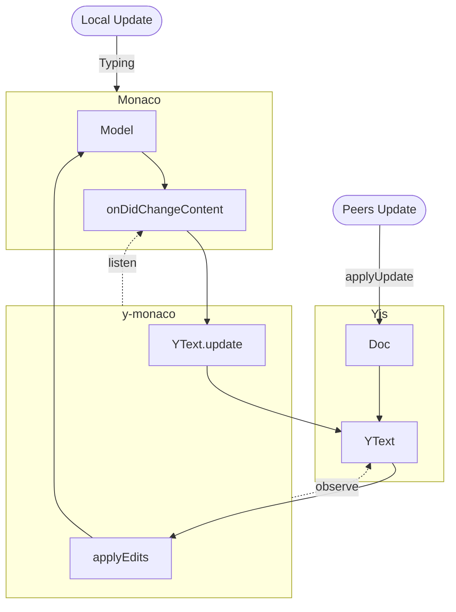
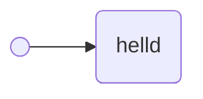
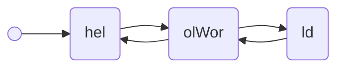
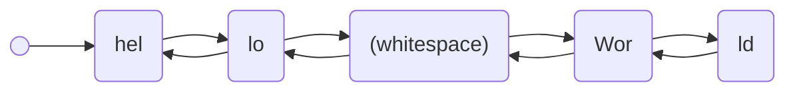

<script setup lang="ts">
import EditorList from './src/editor-list.vue'
import YMonacoBasic from './src/episode2/y-monaco-basic.vue'
</script>

在这一篇中，我们将在之前已实现了的 `Monaco` 协同编辑器基础上，更深入的探索 `Yjs`，以及我所说的潜在的问题。

---

让我们从一个简单的场景开始：如何在已有的代码上，加入协同功能。换句话说，如何给我们的编辑器加入初始化内容。

> 在[上一篇](./01-the-good-days-of-collaboration-system.md)中，所有展示的编辑器，都被赋予了 `Hello world!` 这样的初始内容。我一开始并没有打算这样，因为想要把初始化内容加进去，涉及到了更深层次知识。但为了文章内容整体的 UI 表现更好，我只能这么做了。

在开始我们的第一次尝试之前，我们得先了解一下基于 `Monaco` 和 `Yjs` 的协同编辑器是如何工作的。协同的核心全部由 `y-monaco` 所实现。如果感兴趣的话，可以自行研究其[源码](https://github.com/yjs/y-monaco)。



`y-monaco` 主要做了两件事情：

- 通过 `Model.onDidChangeContent` 事件监听用户在编辑器做出的任何输入行为，并同步到 `Yjs` 的 `Text` 类型。同时，`Doc.onChange` 也会被触发，可以在回调中把本地更新广播给 Peer
- 通过 `Text.observe` 监听任何 Peer 端同步的更新，使用 `Model.applyEdits` 将更新的内容同步到 `Monaco` 编辑器中，进而展示给用户

看上去非常清晰，我们仅需要通过两个事件监听，就能给将 `Monaco` 和 `Yjs` 链接，并且在更新循环中完成我们的协作系统。

那么就下来就让我们继续一开始打算做的事情，给编辑器加上初始化内容：“Hello World!”。

### 第一次尝试

让我们先从为编辑器设置初始值开始。`Monaco` 的 `Model` 为我们提供了 `setValue` 方法，可以非常便捷地设置初始值。

```ts {13}
class CollaborativeDoc {
  async bind(editor: Editor) {
    const { MonacoBinding } = await import('y-monaco')
    const content = this.#doc.getText('content')
    const model = editor.getModel()

    const binding = new MonacoBinding(
      content,
      model,
      new Set([editor]),
    )

    model.setValue('Hello World!')
  }
}
```

看上去非常简单，让我们看看实际效果如何。

<EditorList :editor="YMonacoBasic" :defaultCount="1" />

结果非常不妙。多个编辑器之间根本无法正常协作，并且每次点击【Add Mocked Peer】增加模拟 Peer 加入协作的时候，已经存在的协作者看到的内容都会被在随机的位置插入新的“Hello World!”初始值。

### How CRDTs work

想要知道是什么导致了如此错乱的结果，我们必须要理解 `Yjs` 是如何实现其数据类型无冲突合并的。

> 这里我会用简短的文字和图例来介绍 `Yjs` 以及其他 `CRDT` 实现的基本原理。我不可能在一篇博客的篇幅中，完全理解他们的核心原理。
> 如果你感兴趣的话，可以到 [crdt.tech](https://crdt.tech) 查看其收录的众多论文以及实现。

简而言之，我们每一次在 `Text` 上的变更，都会被 `Yjs` 编码成一个二进制 `Update`。而这个 `Update` 解码之后遍可以得到类似下面的结构：

```ts
// 我仅仅挑了三个在我们讨论的话题下相对重要的属性，并省略了其他的。
type Update {
  id: ID
  left: ID
  right: ID
  content: string
}
```

这些字段分别代表着：

**id** 是 `Yjs` 为每一个变更创建一个全局唯一的 id，其形式是 `[Client, Clock]`。`Client` 是 `Doc` 实例在初始化的时候自动创建的一个随机数，用以记录变更所发生的客户端。`Clock` 则可简单理解为当前 `Client` 发生过的变更内容的总*长度*，其值为从 0 开始的单调递增的整数。
**left** 和 **right** 记录了变更发生时，变更位置左和右相邻元素的 ID。由于 `Yjs` 的 `Update` 仅会包含了当前变更的增量数据，所以相对位置是必须的信息。其和**id**，能够使所有的变更形成了一个双向链表，这便是 `Yjs` 实现 CRDT 的基础。
**content** 是存放当前变更所修改内容的字面值。

```ts
const doc = new Doc()
const updates = []
doc.on('update', (update) => {
  updates.push(decodeUpdate(update))
})

const text = doc.getText('content')
text.insert(0, 'helld') // "helld"
text.insert(3, 'loWor') // "HelloWorld"
text.insert(5, ' ')     // "Hello World"
```

上面的更改会产出如下三个 `Update`。通过三个图例，我们可以更好的理解这些变更在 `Yjs` 内部是如何被链接起来的。

::: code-group

```ts [code]
// 假设当前 Client 为 5433
const updates = [
  { id: [5433, 0], left: null, right: null, content: 'helld' },
  { id: [5433, 5], left: [5433, 2]， right: [5433, 3], content: 'loWor' },
  { id: [5433, 10], left: [5433, 6], right: [5433, 7], content: ' ' },
]
```






:::